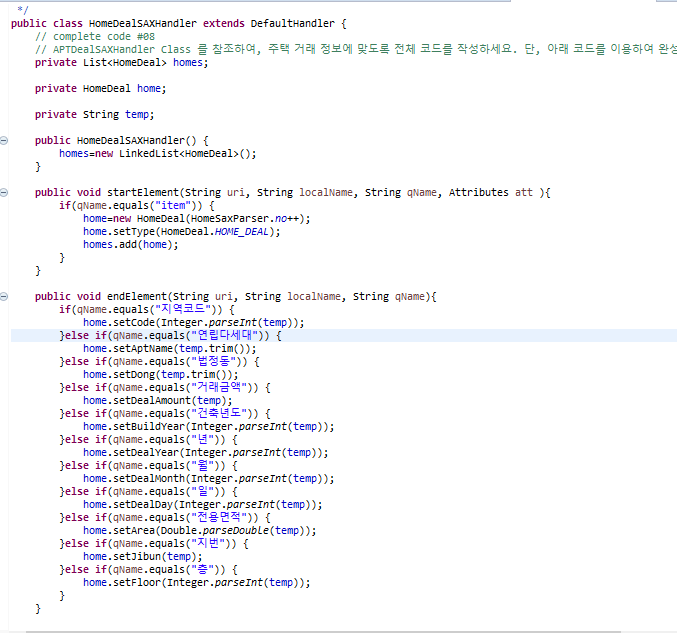

# Member

pair4 김영경 양주연

## Requirements

- 관통 프로젝트
- 자바
- 해피하우스

## Application Structure

- `View`: UI 역할
- `Service`: 비즈니스 로직 구현
- `Dao`: 데이터베이스 접근, 도메인 객체를 DB에 저장하고 관리
- `Dto`: 비즈니스 도메인 객체

## 결과화면
### 아무런 조건도 주지 않았을 경우

### 동으로 조회한 경우

### 아파트 이름으로 조회한 경우

### [추가 기능] 주변 환경 오염 정보 분석

 
환경 오염 정보 버튼 클릭 시, 서대문구 환경 지도점검 데이터를 테이블 형태로 출력

 
관심있는 점검 항목을 클릭 시 해당 점검 정보 출력 

### [심화 기능] 관심 지역 상권 정보 출력

주변 상가 정보 버튼 클릭 시, 아무것도 선택하지 않을 경우 서울시 전체 상권 정보가 출력된다.

 
관심 있는 아파트 또는 주택을 클릭 시 해당 동의 주변 상권 정보 출력
-> 서울시 법정동별 상권 정보 출력

## 제출 소스
| ClassName  code line No. | code                                                         |
| ------------------------ | :----------------------------------------------------------- |
| HouseInfoView 246~247    |  |
| HouseServiceImpl 34      |  |
| HouseDaoImpl  80         |  HouseInfo에 저장된 이미지 소스를 HouseDeal 인스턴스의 멤버 변수에 세팅 |
| APTRentSAXHandler 28~    |  |
| HouseDealSAXHandler      |  |

## 추가 기능 추가한 파일
- EnvPollutDAO.java
- EnvPollutDAOImpl.java
- EnvPollut.java
- EnvService.java
- EnvServiceImpl.java
- EnvView.java
- SeodaemoonEnvPollut.csv

## 심화 기능 추가한 파일
- ComDao.java
- ComDaoImpl.java
- ComService.java
- ComServiceImpl.java
- CommercialView.java
- HomeDeal.java
- CSVReader.java
- ComInfoView.java
- market.csv