# 메인화면

| 구현내용        | code              |
| :-------------- | :---------------- |
| 메인페이지 html | index.html        |
| 메인 js         | assets/js/main.js |

- 메인화면은 부트스트랩을 이용하여 창을 조절하면 그에 맞게 인터페이스가 바뀝니다.
- swiper로 구현하였기 때문에 사진이 계속 변경됩니다.

  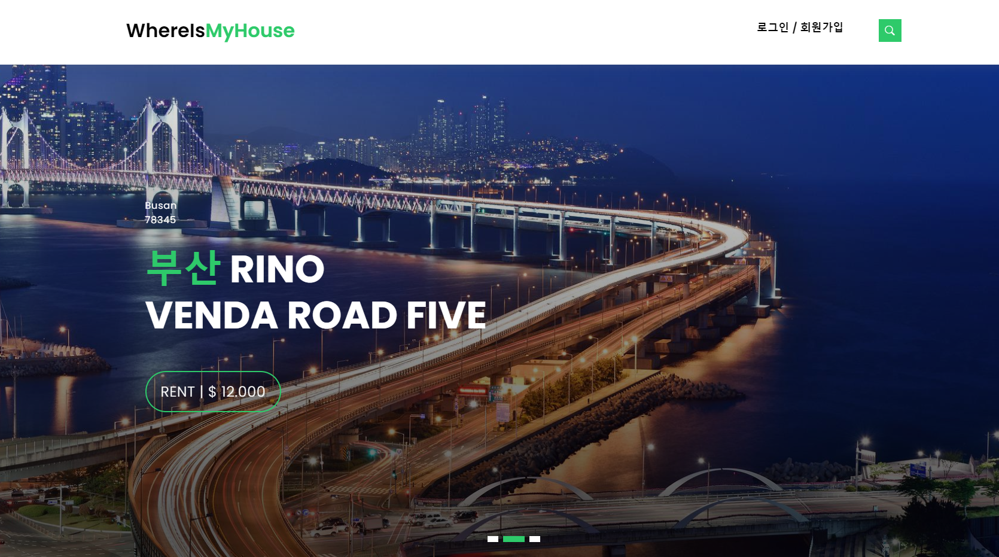
  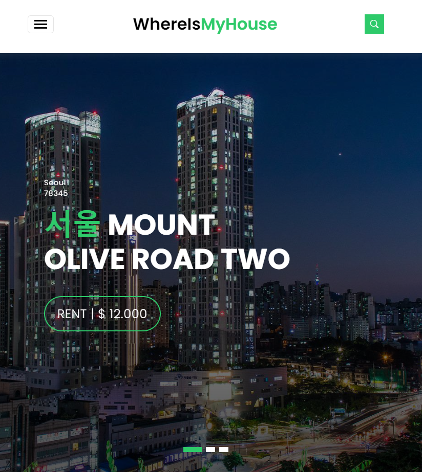

# 검색화면

| 구현내용         | code         |
| :--------------- | :----------- |
| 아파트 조회 html | aptlist.html |
| 아파트 조회 js   | apt.js       |

- 실거래가 조회 화면

  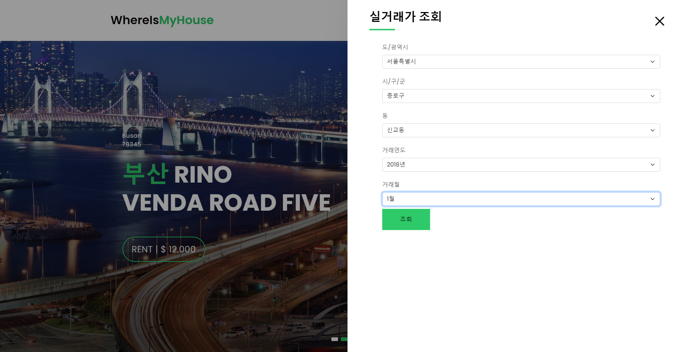

- 조회 결과

  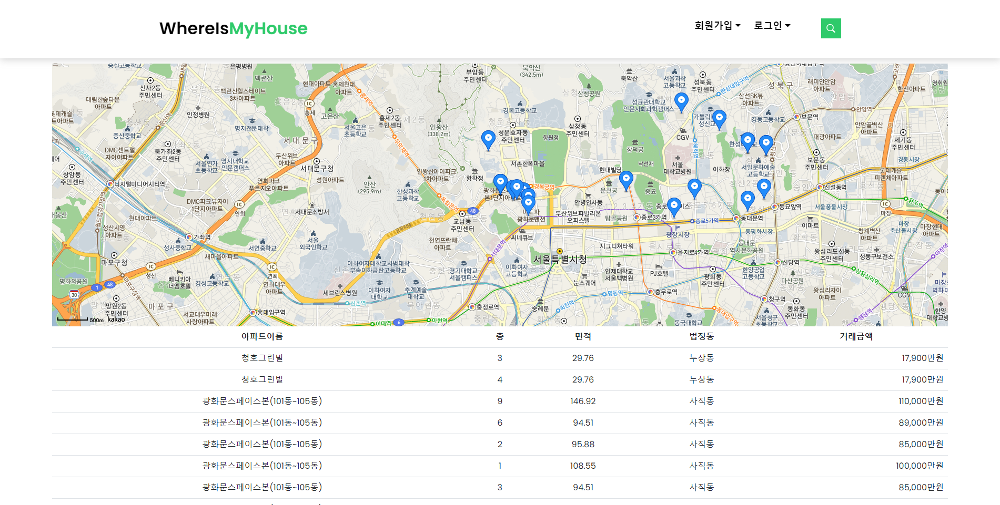

- 아파트 상세 정보

  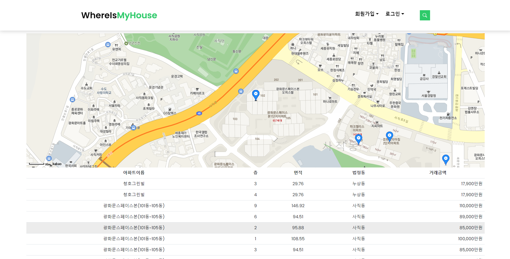

# 로그인

| 구현내용       | code              |
| :------------- | :---------------- |
| 로그인 창 구현 | main.html         |
| 로그인 js      | assets/js/main.js |

- 초기에는 로그인 드롭다운 방식으로 했으나 인터페이스의 개선을 위해 창을 새로 만들었습니다.
- 지금은 세션을 통해 확인하여 로그인 기능을 수행합니다.

  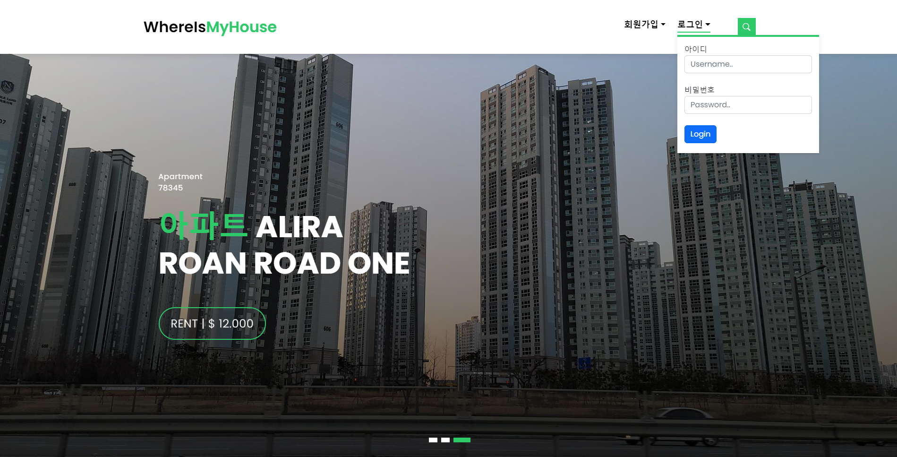

  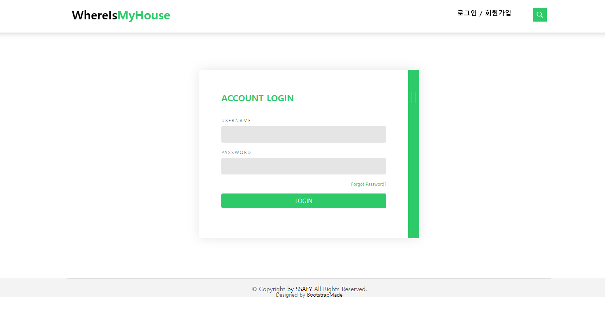

- 로그인 후 네비게이션 바에 로그아웃 버튼 생성

  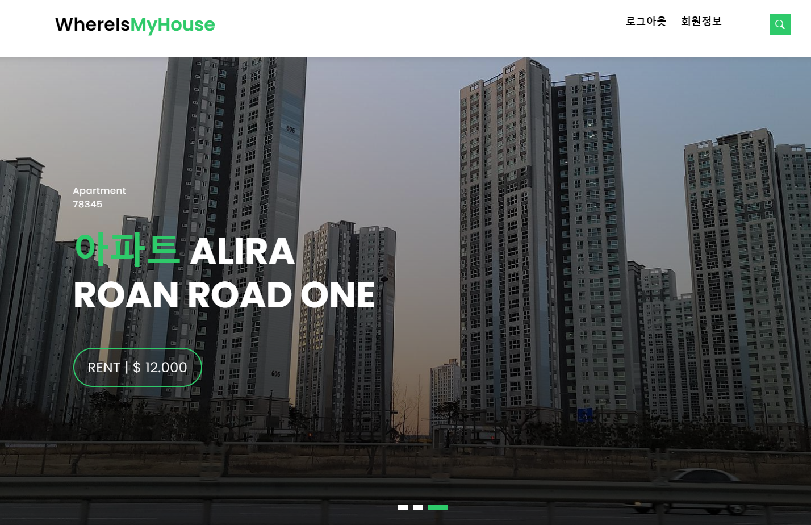

# 회원가입

| 구현내용         | code              |
| :--------------- | :---------------- |
| 회원가입 창 구현 | main.html         |
| 회원가입 js      | assets/js/main.js |

- 초기에는 회원가입 드롭다운 방식으로 했으나 인터페이스의 개선을 위해 창을 새로 만들었습니다.
- 로그인 화면에서 옆 쪽을 누르면 화면이 나타납니다.

  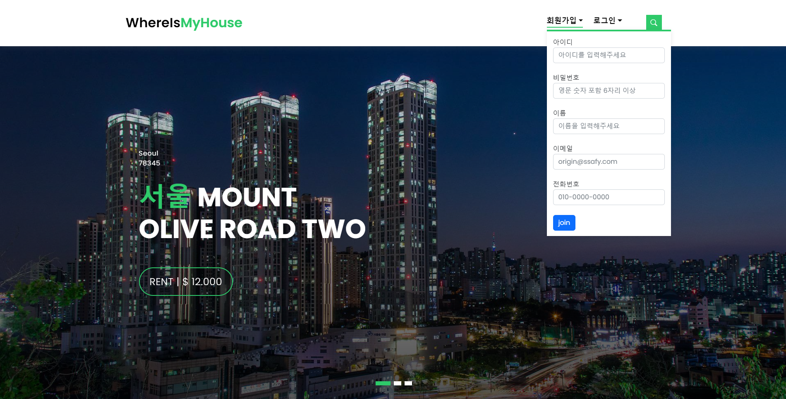

  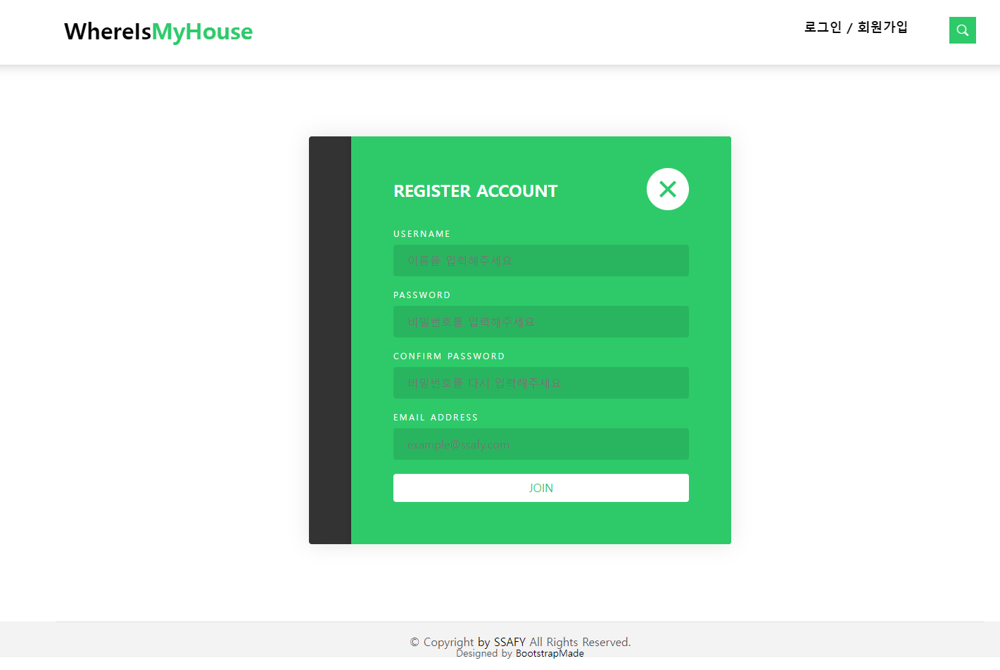

- 회원가입시에는 모든 항목을 체크한 뒤 회원가입을 진행하게 됩니다.

  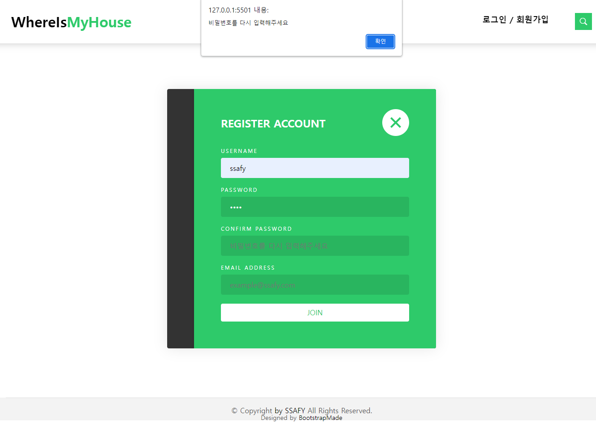

# 로그아웃

| 구현내용           | code              |
| :----------------- | :---------------- |
| 로그아웃 버튼 구현 | main.html         |
| 로그아웃 js        | assets/js/main.js |

- 네비게이션 바에 로그아웃 버튼

  

  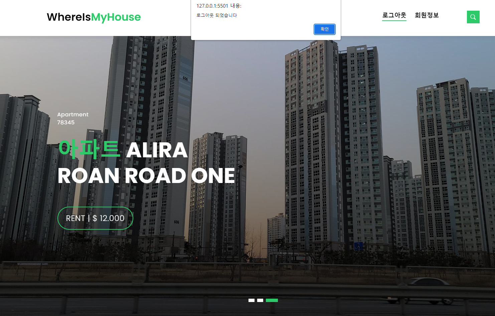

# 회원정보

| 구현내용        | code         |
| :-------------- | :----------- |
| 회원정보 페이지 | contact.html |

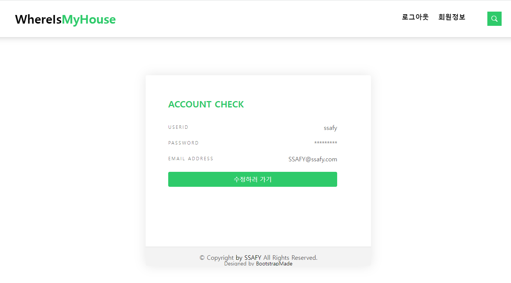

# 회원정보 수정

| 구현내용        | code         |
| :-------------- | :----------- |
| 회원정보 페이지 | contact.html |

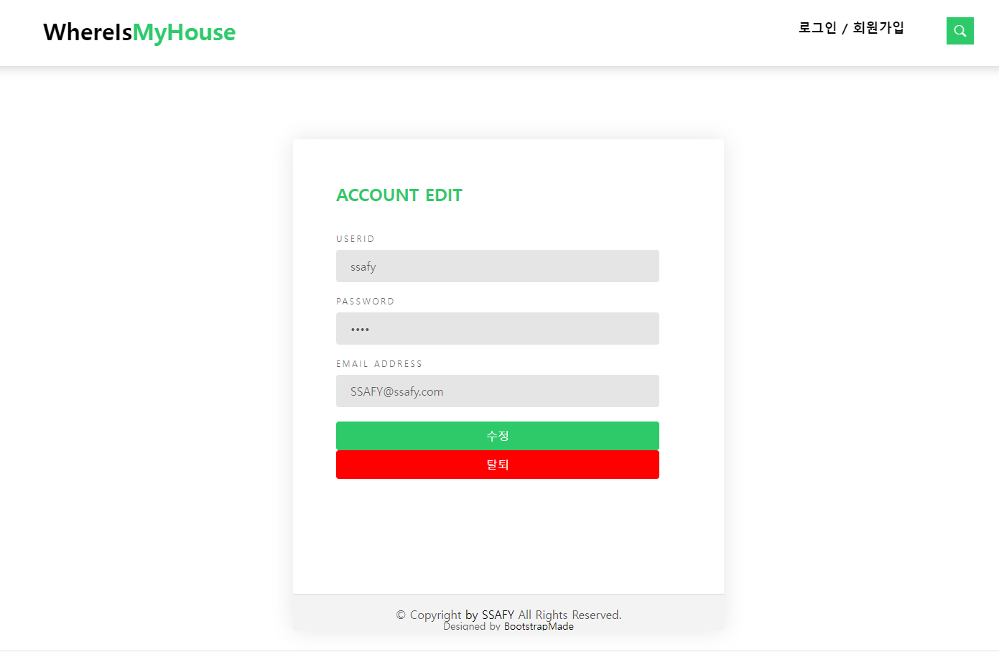

# 비밀번호 찾기

- 로그인창에서 'Forgot Password?'를 누르게 되면 비밀번호 찾기 페이지로 이동합니다.
- 비밀번호 찾기는 아이디와 비밀번호를 입력하도록 되어있습니다.
- 추후 사용자 정보를 확인하여 있는 회원일 경우 이메일로 임시 비밀번호를 발급하는 방식을 생각하고 있습니다.

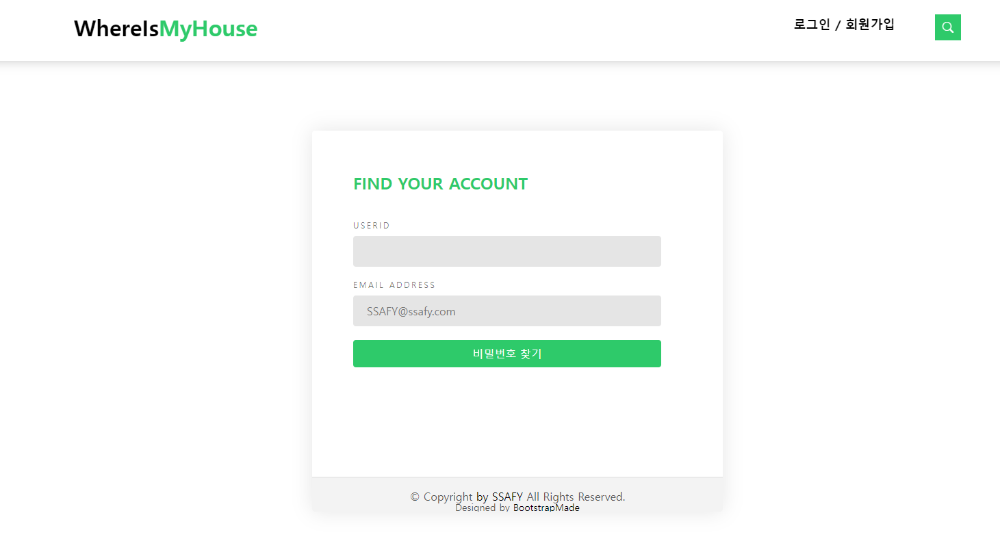
