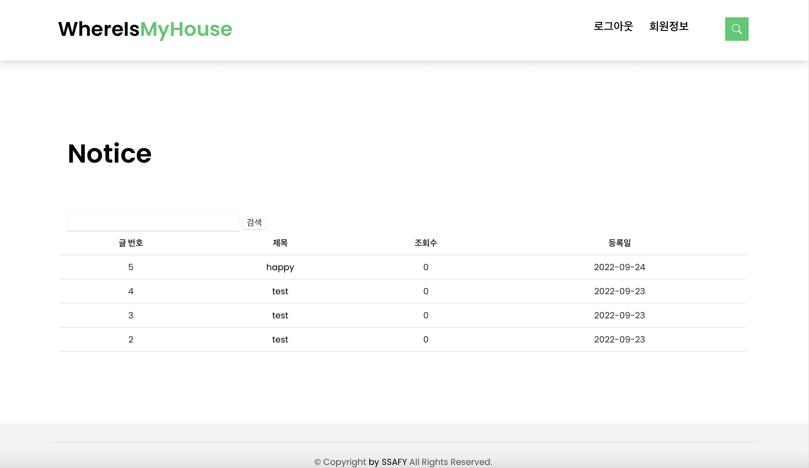

# HAPPY HOUSE BACKEND

### 팀원
김보라 양주연 채예진 

# 메인화면

| 구현 기능        | URL            |
| :-------------- | :---------------- |
| 메인페이지 | http://localhost:8080/pair11_KimBoRa_YangJuYeon_ChaeYeJin/ |

  
  
  
- 메인화면은 부트스트랩을 이용하여 창을 조절하면 그에 맞게 인터페이스가 바뀝니다.
- swiper로 구현하였기 때문에 사진이 계속 변경됩니다.
- 스크롤바를 내리면 공지사항/동네 업종 정보 조회/동네 환경 점검 정보 조회 메뉴를 확인할 수 있습니다.
- 로그인을 하면 상단바 메뉴가 로그아웃/회원정보 메뉴로 바뀝니다.

# 회원 관리
| 구현 기능        | URL            |
| :-------------- | :---------------- |
| 회원가입         | http://localhost:8080/pair11_KimBoRa_YangJuYeon_ChaeYeJin/member?sign=mvjoin |
| 회원정보조회      | http://localhost:8080/pair11_KimBoRa_YangJuYeon_ChaeYeJin/member?sign=mvInfo |
| 회원정보수정      | http://localhost:8080/pair11_KimBoRa_YangJuYeon_ChaeYeJin/member?sign=mvUpdateInfo |
| 회원탈퇴       | http://localhost:8080/pair11_KimBoRa_YangJuYeon_ChaeYeJin/member?sign=mvUpdateInfo |

### 회원가입 화면

  
  
  
  
  
  
  

- 회원가입은 성공하면 로그인 페이지로 이동합니다.
- 회원가입을 실패하면 회원가입 페이지에 머물러 있습니다.
- 값을 입력하지 않은 칸이 있다면 입력해달라는 경고문이 뜹니다.
- 아이디는 4-10자 이내로 입력 가능하며, 비밀번호는 6-20자 이내로 입력 가능합니다. 이에 맞지 않으면 경고문이 뜹니다.
- 비밀번호와 비밀번호 확인이 일치하지 않으면 경고문이 뜹니다.
- 이메일은 '([\w\.-]+)@([a-z\d\.-]+)\.([a-z\.]{2,6})' 해당 정규식에 맞지 않는 형식이면 경고문이 뜹니다.

### 회원정보조회 화면

  

- 회원정보조회는 회원정보 메뉴를 눌렀을 때 확인 가능합니다.
- 동기 GET 방식으로 회원정보를 가져옵니다.

### 회원정보수정 화면

  
  
  
  
  
- 회원수정은 성공하면 회원정보조회 페이지로 이동합니다.
- 회원수정을 실패하면 회원수정 페이지에 머물러 있습니다.
- 회원정보조회 페이지에서 '수정하러 가기' 버튼을 누르면 수정 페이지로 전환됩니다.
- 아이디는 readonly로, 수정이 불가능합니다.
- 비밀번호와 이메일 입력은 회원가입과 동일하게 6~20자 이내로 입력해야하며, 정규식에 맞는 형식이어야 합니다.

### 회원탈퇴 화면

  

- 회원탈퇴가 성공하면 데이터베이스에서 회원 삭제가 이루어지고, 자동으로 로그아웃이 되면서 메인화면으로 이동합니다.
- 회원탈퇴가 이루어지기 전에 '정말 삭제하시겠습니까?' 안내문구가 뜨고, 확인을 누르면 회원탈퇴가 이루어지고 취소를 누르면 회원정보수정 페이지에 머무르게 됩니다.

# 로그인 관리
| 구현 기능       | URL            |
| :-------------- | :---------------- |
| 로그인         | http://localhost:8080/pair11_KimBoRa_YangJuYeon_ChaeYeJin/member?sign=mvjoin |
| 로그아웃         |  |

  
  
  

- 로그인을 성공하면 메인화면으로 이동하고, session에 값을 저장합니다.
- 로그인을 실패하면 경고문이 뜨고, 로그인 페이지에 머물러 있습니다.
- 로그아웃은 session에 있는 값을 삭제하고, 메인화면으로 돌아갑니다.

# 공지사항 관리
| 구현 기능       | URL            | 권한            |
| :-------------- | :---------------- | :---------------- |
| 공지사항 생성        | http://localhost:8080/pair11_KimBoRa_YangJuYeon_ChaeYeJin/board?sign=mvnotice | 관리자 |
| 공지사항 조회        | http://localhost:8080/pair11_KimBoRa_YangJuYeon_ChaeYeJin/board?sign=mvboardwrite | 모든 회원 |
| 공지사항 수정        | http://localhost:8080/pair11_KimBoRa_YangJuYeon_ChaeYeJin/board?sign=mvboardedit&idx=2 | 관리자 |
| 공지사항 삭제        | http://localhost:8080/pair11_KimBoRa_YangJuYeon_ChaeYeJin/board?sign=mvboardedit&idx=2 | 관리자 |

### 공지사항 생성

  
  
- 공지사항 생성은 관리자만 가능합니다.
- 공지사항 생성을 성공하면 공지사항 조회 페이지로 넘어갑니다.
- 작성자는 admin으로 고정되어 있으며, 변경할 수 없습니다.

  
### 공지사항 조회

  
  

- 공지사항 조회는 관리자 뿐 아니라 모든 회원이 가능합니다.

### 공지사항 수정/삭제

  

- 공지사항 수정 및 삭제는 관리자만 가능합니다.
- 공지사항을 수정 및 삭제하면 조회 페이지로 이동합니다.

# 동네 업종 정보
| 구현 기능       | URL            |
| :-------------- | :---------------- |
| 동네 업종 정보 조회  | http://localhost:8080/pair11_KimBoRa_YangJuYeon_ChaeYeJin/businessInfo.jsp |

  

- 공공 데이터 포탈에서 상권정보 api를 받아와서 화면에 띄웁니다.

# 동네 환경 점검 정보 정보
| 구현 기능       | URL            |
| :-------------- | :---------------- |
| 동네 업종 정보 조회  | http://localhost:8080/pair11_KimBoRa_YangJuYeon_ChaeYeJin/envInspInfo.jsp |

  

- 서울 열린 데이터 광장에서 환경 지도 점검 api를 받아와서 화면에 띄웁니다.
