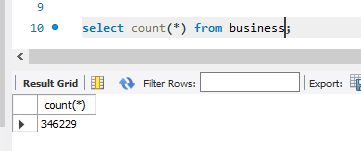
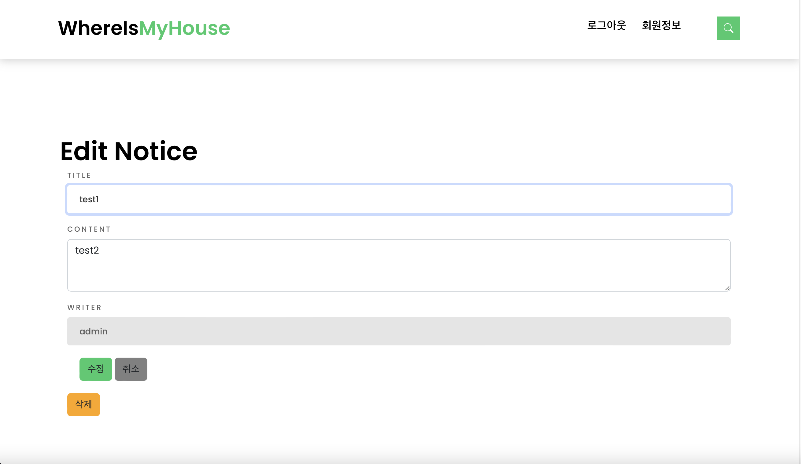

# HAPPY HOUSE DB
- 필수기능, 추가기능, 심화기능 모두 구현 완료했습니다.
- DB 설계 및 구현, 데이터 가공 뿐 아니라 보여주는 페이지까지 만들어 작동을 확인했습니다.

### 팀원
김보라 양주연 채예진 

# ER Diagram
  
  
- business : 상권 정보
- hospital : 국민 안심 병원 목록
- clinic : 코로나 선별 진료소 현황
- housedeal : 주택 실 거래
- dongcode : 동 코드
- houseinfo : 주택 정보
- notice : 공지사항
- environment : 환경 지도점검 데이터
- interestplace : 관심지역
- user : 사용자 정보

- 데이터베이스는 제공되는 자료들 중 유의미한 자료들을 추출하여 설계한 데이터베이스에 맞도록 가공하였습니다.
- 데이터베이스 생성 파일은 resources의 main.sql에서 확인 가능합니다.
- 데이터베이스의 입력 값은 행이 너무 많아 자료를 나누었습니다. resources에서 확인 가능합니다.
- 각각의 데이터는 국민안심병원(hospital) 257건, 상권정보(서울)(business) 346229건, 선별진료소(clinic) 601건, 환경정보(environment) 25117건입니다.

# 메인화면

| 구현 기능        | URL            |
| :-------------- | :---------------- |
| 메인페이지 | http://localhost:8080/pair11_KimBoRa_YangJuYeon_ChaeYeJin/ |

  
  
  
- 메인화면은 부트스트랩을 이용하여 창을 조절하면 그에 맞게 인터페이스가 바뀝니다.
- swiper로 구현하였기 때문에 사진이 계속 변경됩니다.
- 스크롤바를 내리면 공지사항/동네 업종 정보 조회/동네 환경 점검 정보 조회 메뉴를 확인할 수 있습니다.
- 로그인을 하면 상단바 메뉴가 로그아웃/회원정보 메뉴로 바뀝니다.

# 실거래 정보 확인

- 메인 페이지의 오른쪽 상단의 검색 아이콘을 누르면 실거래 조회가 토글됩니다.

- 추후 회원가입과 회원 정보 수정에서도 사용하는 시군구 정보들은 데이터베이스에서 값을 가져옵니다.

- 정보를 전부 선택한 뒤 조회 버튼을 누르면 실거래 정보를 확인할 수 있습니다.
- 지도에서는 휠을 이용하여 가까이 혹은 멀리 확인할 수 있습니다.

- 목록에서 값을 누르게 되면 해당 열의 아파트 위치로 이동하게 됩니다.

# 회원 관리
| 구현 기능        | URL            |
| :-------------- | :---------------- |
| 회원가입         | http://localhost:8080/pair11_KimBoRa_YangJuYeon_ChaeYeJin/member?sign=mvjoin |
| 회원정보조회      | http://localhost:8080/pair11_KimBoRa_YangJuYeon_ChaeYeJin/member?sign=mvInfo |
| 회원정보수정      | http://localhost:8080/pair11_KimBoRa_YangJuYeon_ChaeYeJin/member?sign=mvUpdateInfo |
| 회원탈퇴       | http://localhost:8080/pair11_KimBoRa_YangJuYeon_ChaeYeJin/member?sign=mvUpdateInfo |

### 회원가입 화면

  
  
  
  
  
  
  
  

- 회원가입은 성공하면 로그인 페이지로 이동합니다.
- 회원가입을 실패하면 회원가입 페이지에 머물러 있습니다.
- 값을 입력하지 않은 칸이 있다면 입력해달라는 경고문이 뜹니다.
- 아이디는 4-10자 이내로 입력 가능하며, 비밀번호는 6-20자 이내로 입력 가능합니다. 이에 맞지 않으면 경고문이 뜹니다.
- 비밀번호와 비밀번호 확인이 일치하지 않으면 경고문이 뜹니다.
- 이메일은 '([\w\.-]+)@([a-z\d\.-]+)\.([a-z\.]{2,6})' 해당 정규식에 맞지 않는 형식이면 경고문이 뜹니다.
- 회원가입시 관심지역을 설정합니다. 선택지들은 전부 드롭다운으로 구현하였으며, 시/도를 선택해야 시/구/군을 선택할 수 있습니다.

### 회원정보조회 화면

  

- 회원정보조회는 회원정보 메뉴를 눌렀을 때 확인 가능합니다.
- 동기 GET 방식으로 회원정보를 가져옵니다.
- 회원정보조회에서 관심지역을 확인할 수 있습니다. 

### 회원정보수정 화면

  
  
  
  
  
  
- 회원수정은 성공하면 회원정보조회 페이지로 이동합니다.
- 회원수정을 실패하면 회원수정 페이지에 머물러 있습니다.
- 회원정보조회 페이지에서 '수정하러 가기' 버튼을 누르면 수정 페이지로 전환됩니다.
- 아이디는 readonly로, 수정이 불가능합니다.
- 비밀번호와 이메일 입력은 회원가입과 동일하게 6~20자 이내로 입력해야하며, 정규식에 맞는 형식이어야 합니다.
- 회원정보수정에서 관심지역을 수정할 수 있습니다.

### 회원탈퇴 화면

  

- 회원탈퇴가 성공하면 데이터베이스에서 회원 삭제가 이루어지고, 자동으로 로그아웃이 되면서 메인화면으로 이동합니다.
- 회원탈퇴가 이루어지기 전에 '정말 삭제하시겠습니까?' 안내문구가 뜨고, 확인을 누르면 회원탈퇴가 이루어지고 취소를 누르면 회원정보수정 페이지에 머무르게 됩니다.

# 로그인 관리
| 구현 기능       | URL            |
| :-------------- | :---------------- |
| 로그인         | http://localhost:8080/pair11_KimBoRa_YangJuYeon_ChaeYeJin/member?sign=mvjoin |
| 로그아웃         |  |

  
  
  

- 로그인을 성공하면 메인화면으로 이동하고, session에 값을 저장합니다.
- 로그인을 실패하면 경고문이 뜨고, 로그인 페이지에 머물러 있습니다.
- 로그아웃은 session에 있는 값을 삭제하고, 메인화면으로 돌아갑니다.

# 공지사항 관리
| 구현 기능       | URL            | 권한            |
| :-------------- | :---------------- | :---------------- |
| 공지사항 생성        | http://localhost:8080/pair11_KimBoRa_YangJuYeon_ChaeYeJin/board?sign=mvnotice | 관리자 |
| 공지사항 조회        | http://localhost:8080/pair11_KimBoRa_YangJuYeon_ChaeYeJin/board?sign=mvboardwrite | 모든 회원 |
| 공지사항 수정        | http://localhost:8080/pair11_KimBoRa_YangJuYeon_ChaeYeJin/board?sign=mvboardedit&idx=2 | 관리자 |
| 공지사항 삭제        | http://localhost:8080/pair11_KimBoRa_YangJuYeon_ChaeYeJin/board?sign=mvboardedit&idx=2 | 관리자 |

### 공지사항 생성

  
  
- 공지사항 생성은 관리자만 가능합니다.
- 공지사항 생성을 성공하면 공지사항 조회 페이지로 넘어갑니다.
- 작성자는 admin으로 고정되어 있으며, 변경할 수 없습니다.

  
### 공지사항 조회

  
  

- 공지사항 조회는 관리자 뿐 아니라 모든 회원이 가능합니다.

### 공지사항 수정/삭제

  

- 공지사항 수정 및 삭제는 관리자만 가능합니다.
- 공지사항을 수정 및 삭제하면 조회 페이지로 이동합니다.

# 화면 이동

- 메인화면에서 스크롤을 내리면 공지사항 옆에 동네 업종 정보와 동네 환경 점검 정보를 확인할 페이지로 이동할 수 있습니다.
- 화면을 스크롤 했을 때 생기는 화살표 버튼을 누르면 메인페이지의 상단으로 이동합니다.
- 공지사항을 제외한 네가지 메뉴는 관심지역을 기반으로 하기 때문에 로그인한 상태가 아니라면 로그인 페이지로 이동하게 됩니다.

- 로그인 했을 경우에는 관심지역 테이블에서 세션의 이메일을 통해 관심지역 코드를 알아낸 후 그를 기반으로 각 테이블에서 정보를 가져오게 됩니다.

# 동네 업종 정보
| 구현 기능       | URL            |
| :-------------- | :---------------- |
| 동네 업종 정보 조회  | http://localhost:8080/pair11_KimBoRa_YangJuYeon_ChaeYeJin/interest?sign=mvbiz |

  
 

- 로그인하지 않았을 경우 이 페이지로 이동하지 않고 로그인 페이지로 이동하게 됩니다.
- 공공 데이터 포탈에서 상권정보 데이터를 다운받아서 파싱 후 데이터베이스에 저장한 값을 화면에 띄웁니다.
- 로그인 세션의 이메일 값을 이용하여 관심지역 테이블 -> 관심지역 동 코드-> 동네 업종 정보를 알아내어 이용합니다.

# 동네 환경 점검 정보
| 구현 기능       | URL            |
| :-------------- | :---------------- |
| 동네 환경 점검 정보 조회 | http://localhost:8080/pair11_KimBoRa_YangJuYeon_ChaeYeJin/interest?sign=mvenv |

  

- 로그인하지 않았을 경우 이 페이지로 이동하지 않고 로그인 페이지로 이동하게 됩니다.
- 서울 열린 데이터 광장에서 환경 지도 점검 데이터를 다운받아서 파싱 후 데이터베이스에 저장한 값을 화면에 띄웁니다.
- 로그인 세션의 이메일 값을 이용하여 관심지역 테이블 -> 관심지역 동 코드 -> 동네 환경 점검 정보를 알아내여 이용합니다.

# 관심 지역 안심 병원 정보
| 구현 기능       | URL            |
| :-------------- | :---------------- |
| 동네 환경 점검 정보 조회 | http://localhost:8080/pair11_KimBoRa_YangJuYeon_ChaeYeJin/interest?sign=mvhospital |

  
  
  - 로그인하지 않았을 경우 이 페이지로 이동하지 않고 로그인 페이지로 이동하게 됩니다.
  - 공공 데이터 포털에서 국민 안심 병원 목록을 다운받아서 데이터베이스에 맞도록 파싱 후 저장한 값을 화면에 띄웁니다.
  - 로그인 세션의 이메일 값 -> 관심지역 테이블 -> 관심지역 동 코드 -> 관심지역 시군구 -> 관심 지역 안심 병원 정보를 알아내어 이용합니다.

# 관심 지역 선별 진료소 정보
| 구현 기능       | URL            |
| :-------------- | :---------------- |
| 동네 환경 점검 정보 조회 | http://localhost:8080/pair11_KimBoRa_YangJuYeon_ChaeYeJin/interest?sign=mvclinic |

  
  
  - 로그인하지 않았을 경우 이 페이지로 이동하지 않고 로그인 페이지로 이동하게 됩니다.
  - 공공 데이터 포털에서 코로나 선별 진료소 현황을 다운받아서 데이터베이스에 맞도록 파싱 후 저장한 값을 화면에 띄웁니다.
  - 로그인 세션의 이메일 값 -> 괌심지역 테이블  -> 관심지역 동 코드 -> 관심지역 시군구 -> 관심지역 선별 진료소 정보를 알아내어 이용합니다.
  
  