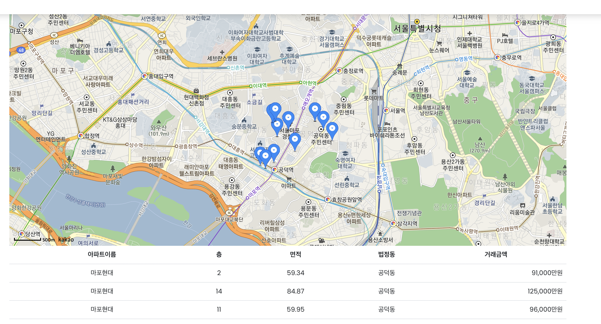

SSAFY 관통 프로젝트 [Web Spirng PJT] \<WhereIsMyHome>
======

### 페어
  양주연, 최태규, 남이랑

### 개발 기간
  2022.11.02

### 개요
WhereIsMyHome 프로젝트를 myBatis Framework를 활용해 구축한다. 

### 요구사항
1. 고객에게 원하는 주택 정보를 검색 할 수 있도록 하고, 그 결과를 분석해서 화면에 표시한다. 또한 관심지역의 상가 검색과 환경 정보 등을 추가적으로 제공할 수 있도록 구현해보자. 
2. Spring Framework와 MyBatis Framework로 구현한다.

기능 구현
======

## ERD


| SQL파일 | [schema.sql]([./WebContent/resources/schema.sql](https://lab.ssafy.com/s08/a19/12_whereismyhome_spring2/pair04_choitaegyu_namirang_yangjuyeon/-/blob/master/src/main/resources/sql/main.sql)) |
|-------|-------------------------------------------------|

## 자바 클래스 다이어그램


<br>
=============


## 구현 기능


- 로그인, 회원가입

  

  

- 게시판 - 검색, 조회, 수정, 삭제, 등록

  

  

  

- 파일 업로드

- 회원정보 - 조회, 수정

  

  

- 아파트 실거래 매매 조회 



- 동네 업종 정보 조회

  

- 동네 환경 점검 정보 조회


- 코로나 선별 진료소 현황


- 국민 안심 병원 목록


- 웹캠


| 구현내용              | 코드                                                            |
|-------------------|---------------------------------------------------------------|
| Member Controller        | [memberController.java]([./WebContent/index.html](https://lab.ssafy.com/s08/a19/12_whereismyhome_spring2/pair04_choitaegyu_namirang_yangjuyeon/-/blob/master/src/main/java/com/ssafy/home/member/controller/MemberController.java))                         |


## MyBatis Framework 적용

```xml <?xml version="1.0" encoding="UTF-8"?>
<mapper namespace="com.ssafy.home.board.mapper.BoardMapper">    
  <update id="updateBoard" parameterType="map">        update board        set content = #{board.content},            title   =#{board.title}        where code = #{code};    </update>    <delete id="deleteBoard" parameterType="int">        delete        from board        where code = #{code};    </delete>    <select id="selectAll" resultType="board">        SELECT code,               originNo,               groupOrd,               groupLayer,               concat(LPAD('>', groupLayer *                                4, '-'), title) title,               content,               writer,               reg_datetime        FROM board        ORDER BY originNo DESC, groupOrd ASC    </select>    <select id="selectOne" resultType="board" parameterType="int">        select *        from board where code = #{code};    </select>    <select id="search" resultType="board">        SELECT code,               originNo,               groupOrd,               groupLayer,               concat(LPAD('>', groupLayer *                                4, '-'), title) title,               content,               writer,               reg_datetime        FROM board        where title like CONCAT('%',#{keyword},'%')        ORDER BY originNo DESC, groupOrd ASC    </select>

<insert id="write" parameterType="board">
    insert into board(writer, title, content, groupLayer)
    values(#{writer}, #{title}, #{content}, 0)

​    <selectKey resultType="int" keyProperty="code" order="AFTER">
​        select last_insert_id()
​    </selectKey>
</insert>

<insert id="createFile" parameterType="board">
    insert into file_info (code, save_folder, original_file, save_file)
    values
    <foreach collection="fileInfos" item="fileinfo" separator=" , ">
        (#{code}, #{fileinfo.saveFolder}, #{fileinfo.originalFile}, #{fileinfo.saveFile})
    </foreach>

</insert>

</mapper>
```

<!DOCTYPE mapper        PUBLIC "-//mybatis.org//DTD Mapper 3.0//EN"        "http://mybatis.org/dtd/mybatis-3-mapper.dtd">


xml 파일
=============

| 구현내용              | 코드                                                            |
|-------------------|---------------------------------------------------------------|
| board.xml       | [board.xml]([./WebContent/index.html](https://lab.ssafy.com/s08/a19/12_whereismyhome_spring2/pair04_choitaegyu_namirang_yangjuyeon/-/blob/master/src/main/resources/mybatis/board.xml))                         |
| interest.xml        | [interest.xml]([./WebContent/member/memberInsert.html](https://lab.ssafy.com/s08/a19/12_whereismyhome_spring2/pair04_choitaegyu_namirang_yangjuyeon/-/blob/master/src/main/resources/mybatis/interest.xml))    |

## 비기능 아이디어


## Interceptor를 이용해서 로그인 필수 기능 구현


```java
	public boolean preHandle(HttpServletRequest request, HttpServletResponse response, Object handler)
			throws Exception {
		HttpSession session = request.getSession(false);
		if (session != null) {
			Member m = (Member) session.getAttribute("member");
			if (m != null) {
				return true;
			}
		}
		response.sendRedirect("/member/loginForm");
		return false;
	}
```


인터셉터에서 session이 null 이면 컨트롤러까지 통과하지 않는다.

```java

    public void addInterceptors(InterceptorRegistry registry) {
        registry.addInterceptor(new SessionInterceptor()).addPathPatterns(
                        "/test/a",
                        "/board/write",
                        "/board/edit",
						"/interest/**",
                        "/member/mvInfo",
                        "/member/update") // 해당 경로에 접근하기
                // 전에 가로챔
                .excludePathPatterns("/test/b");// 해당 경로는 인터셉터가 가로채지 않는다.
    }
```


로그인이 필요한 기능에 대해서 interceptor 설정을 해서 로그인 하지 않는 사용자를 검증한다.


### SQL Injection 방어

- Mybatis를 이용해서 SQL injection을 방어 할 수 있다.

- \#{}를 사용하면 PreparedStatement를 사용해서 SQL injection을 방어 할 수 있다.

- ```xml
  	<update id="updateMember" parameterType="member">
  		update member
  		set name     = #{name},
  			nickname = #{nickname},
  			password = #{password}
  		where email = #{email}
  	</update>
  ```

### 공유 데이터 동기화 부재

- 클래스 안에 공유 변수의 개수를 최소화한다
- 공유 변수를 사용해야 할 경우 synchronized를 사용한다.
- 수정이 일어나는 곳만 synchronized를 사용한다.


### 안전하지 않은 예외처리

- 공통 예외처리 부분을 만든다.

- 상세한 예외에러를 외부에 노출하지 않는다.

- 입력값에 대해 검증을 해서 에러를 최소화 한다.

  

### XSS(Cross Site Scripting) 취약점 방어

- Jsoup을 사용한 화이트 리스트 방식의 XSS 공격방어
- OWASP Antisamy, 
- NAVER Lucy XSS Filter,
-  ESAPI
- httpOnly() 사용 
- 입력 값 제한, 입력 값 치환, 스크립트 영역에 출력 자제, PLURA V5 XSS 필터 사용

### Lombok 사용시 주의할 점

1. 에러메세지가 안남 (조용히 안돌아감)

2. @Data (@NoArgsConstructor + @Getter + @Setter + @ToString + @EqualsAndHashCode) 사용하지 말고 각 세부기능별로 annotation을 붙여서 만들어야함

   1. @AllArgsConstructor, @RequiredArgsContstructor 사용 금지

      - @AllArgsConstructor : 객체 내부의 인스턴스멤버들을 모두 가지고 있는 생성자를 생성하는 Lombok 어노테이션
      - @RequiredArgsConstructor : 객체 내부의 final, @Notnull 이 붙은 인스턴스멤버들을 가지고 있는 생성자를 생성하는 Lombok 어노테이션

      두 어노테이션은 인스턴스 멤버의 순서가 중요하다. 인스턴스 멤버의 순서가 바뀌면 오류 발생이 되지 않고 조용히 값이 바뀐다 …

   2. 무분별한 @EqualsAndHashCode 사용금지

   - @EqualsAndHashCode : equals 메소드와 hashcode 메소드를 생성하는 Lombok 어노테이션

     객체 내부 인스턴스 멤버의 값이 바뀌면 안되기 때문에 (id, name)중에서 나중에 name 값을 바꾸면 동일한 객체로 판단하지 못함

3. @Getter @Setter @ToString 정도만 잘 사용하면 문제 없다

### Lombok만 사용할 때

```java
@AllArgsConstructor
@Data
public class Member {
	private String email, name, password, nickname;
}
```

- 유효성 검사 관련 Annotation 종류
  - JSR-303 Validator
    - @AssertFalse - 거짓인가?
    - @AssertTrue - 참인가?
    - @Max - 지정 값 이하인가?
    - @Min - 지정 값 이상인가?
    - @DecimalMax - 지정 값 이하 실수인가?
    - @DecimalMin - 지정 값 이상 실수인가?
    - @NotNull - Null이 아닌가?
    - @Null - Null 인가?
    - @Digits (integer=, fraction=) - 대상 수가 지정된 정수, 소수 자리 수 이내인가?
    - @Pattern(regex=,flag=) - 정규식을 만족 하는가?
    - @Future - 미래날짜인가?
    - @Past - 과거 날짜인가?
    - @Size(min=, max=) - 문자열, 배열 등의 크기가 지정크기를 만족 하는가?
  - Hibernate
    - @NotEmpty - Empty 값이 아닌가?
    - @Email - 이메일 형식인가?
    - @URL - URL 형식인가?
    - @Length(min=, max=) - 문자열의 길이가 min과 max 사이인가?
    - @Range(min=, max=) - 숫자 범위가 min과 max 사이인가?

### Lombok + Spring @Valid Annotation 사용해서 유효성 검사

```java
@Getter
@Setter
@ToString
@NoArgsConstructor
public class UserDto {
    private Long id;

    @NotBlank(message = "닉네임은 필수 입력 값입니다.")
    private String nickname;

    @NotBlank(message = "이메일은 필수 입력 값입니다.")
    @Email(message = "이메일 형식에 맞지 않습니다.")
    private String email;

    @NotBlank(message = "비밀번호는 필수 입력 값입니다.")
    @Pattern(regexp="(?=.*[0-9])(?=.*[a-zA-Z])(?=.*\\\\W)(?=\\\\S+$).{8,20}",
            message = "비밀번호는 영문 대,소문자와 숫자, 특수기호가 적어도 1개 이상씩 포함된 8자 ~ 20자의 비밀번호여야 합니다.")
    private String password;

    @Builder
    public UserDto(Long id, String nickname, String email, String password) {
        this.id = id;
        this.nickname = nickname;
        this.email = email;
        this.password = password;
    }
}
```

### Getter/Setter


```java
package member.dto;

public class Member {
private String id, pw, name;

public Member(String id, String pw) {
	super();
	setId(id);
	setPw(pw);
}

public Member(String id, String pw, String name) {
	super();
	setId(id);
	setPw(pw);
	setName(name);
}

public Member() {
	super();
}

public String getId() {
	return id;
}

public void setId(String id) {
    if (id != null) {
        this.id = id;
    } else {
        System.out.println("유효하지 않은 id입니다.");
    }
}

public String getPw() {
	return pw;
}

 public void setPw(String pw) {
        if (id != null) {
            this.pw = pw;
        } else {
            System.out.println("유효하지 않은 패스워드입니다.");
        }

    }

public String getName() {
	return name;
}

 public void setName(String name) {
        if (id != null) {
            this.name = name;
        } else {
            System.out.println("유효하지 않은 이름입니다.");
        }

    }
    }
```


### CSRF(Cross Site Request Forgery) 취약점 

- 방어세션에 임의난수(토큰)를 발급해서, 해당 난수가 없는 상황에서 해당 동작들이 이루어지면 요청을 거부하는 방법을 통하여 사용자가 정말로 변경을 의도하는 경우에만 변경을 시켜주는 방법.
-  (사용자는 매 요청마다 token을 함께 보내어 서버의 검증을 거쳐야 함)변경 시에 CAPTCHA를 이용하여 CAPTCHA 인증코드가 없거나 틀리면 거부하도록 하는 방법 
- Double Submit Cookie 검증
